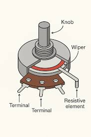
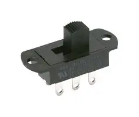

#### Introduction

Arduino is an open-source microcontroller platform widely used for learning embedded systems and Internet of Things (IoT) applications. It allows users to interface various input and output components through its digital and analog pins. These pins help Arduino sense user actions or environmental changes and process them into meaningful digital signals.

In this experiment, basic input components such as a **push button, potentiometer, slider switch, and photoresistor (LDR)** are interfaced with Arduino. The experiment helps learners understand how physical inputs are converted into electrical signals and how Arduino reads and processes these signals. This knowledge forms the foundation for building advanced applications like smart home systems, automation, robotics, and sensor-based monitoring systems.

#### Arduino as an Input Processing Unit

Arduino processes inputs using two main types of pins:

- **Digital Pins:** Used to read binary values such as HIGH (1) or LOW (0)
- **Analog Pins:** Used to read varying voltage levels between 0V and 5V

Arduino contains an **Analog-to-Digital Converter (ADC)** which converts analog voltage values into digital values ranging from **0 to 1023**. This enables Arduino to read data from sensors like potentiometers and LDRs accurately.

#### Components

#### 1. **Arduino Uno**

The Arduino Uno is an open-source microcontroller board based on the ATmega328P microcontroller. It is one of the most widely used development boards for learning embedded systems and IoT.

Key Specifications:

- Microcontroller: ATmega328P

- Operating Voltage: 5V

- Digital I/O Pins: 14 (6 PWM)

- Analog Input Pins: 6

- Flash Memory: 32 KB

- Clock Speed: 16 MHz

Arduino Uno supports both digital and analog inputs/outputs, making it suitable for interfacing sensors, actuators, and communication modules.

#### 2. **Push Button**

A push button is a simple digital input device that works on the principle of momentary switching. When the button is pressed, the circuit is completed and a digital signal is sent to the Arduino. When released, the circuit becomes open.

The push button is connected to a digital pin of Arduino and can use either an external pull-down resistor or Arduino’s internal pull-up resistor.

**Applications:**
- User input selection  
- Reset buttons  
- Start/Stop controls  

#### 3. **Potentiometer**

A potentiometer is a three-terminal variable resistor that is widely used in electronic circuits to manually adjust voltage levels. It works on the principle of a voltage divider, meaning it divides the input voltage into smaller portions based on the position of its rotating shaft (knob).

When the knob is rotated, the internal wiper moves along a resistive track. This movement changes the resistance between the terminals, resulting in a varying output voltage. In Arduino projects, this output voltage typically varies between 0V and 5V, depending on the supply voltage provided to the potentiometer.

**Applications:**
- Brightness control  
- Volume control  
- Speed control  

#### 4. **Slider Switch**

A slide switch is a manual electrical switch used to turn a circuit ON or OFF by sliding a small lever back and forth. It is a simple digital input device.

Slide switches are commonly available in:

- SPST (Single Pole Single Throw)

- SPDT (Single Pole Double Throw)

In Arduino projects, one terminal is connected to 5V, the other to GND, and the middle terminal is connected to a digital pin (e.g., D2). Arduino reads the state using the digitalRead() function.

**Applications:**
- Mode selection  
- Power control  
- Configuration switching  

#### 5. **Photoresistor (LDR – Light Dependent Resistor)**

A Light Dependent Resistor (LDR) is a type of resistor whose resistance changes according to the intensity of light falling on it. It works on the principle of photoconductivity.

- When light intensity increases, resistance decreases

- When light intensity decreases, resistance increases

Since Arduino cannot directly measure resistance, the LDR is connected in a voltage divider circuit along with a fixed resistor. The output voltage from the voltage divider is then connected to an analog pin (e.g., A0) of Arduino.

Arduino reads this voltage using the analogRead() function and converts it into digital values ranging from 0 to 1023.

**Behavior:**
- Bright light → Higher analog value  
- Darkness → Lower analog value  

**Applications:**
- Automatic street lights  
- Light intensity measurement  
- Smart lighting systems  

#### Circuit Connections

1. **Push Button Connection**
   - One terminal of the push button is connected to a **digital input pin** of Arduino.
   - The other terminal is connected to **ground (GND)**.
   - A pull-up or pull-down resistor is used to avoid floating values.

2. **Potentiometer Connection**
   - One end connected to **5V**
   - Other end connected to **GND**
   - Middle pin connected to an **analog pin**

3. **Slider Switch Connection**
   - Common pin connected to a **digital pin**
   - Other terminals connected to **5V** and **GND**

4. **LDR Connection**
   - LDR connected in series with a fixed resistor
   - Output taken from the junction and connected to an **analog pin**

#### Conclusion

This experiment demonstrates the interfacing of basic input components with Arduino and explains how different types of inputs are read using digital and analog pins. Understanding these components is essential for developing real-world embedded systems and IoT applications.

