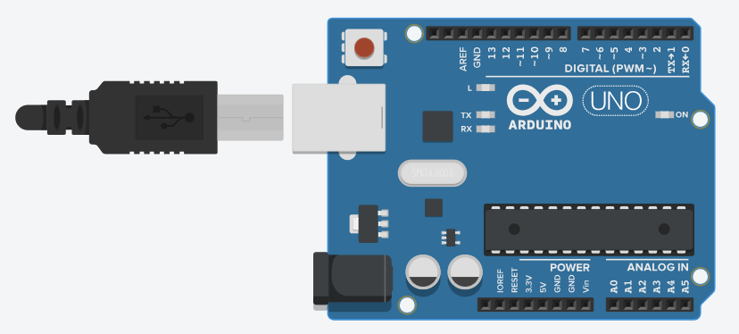
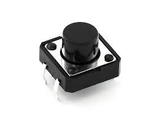
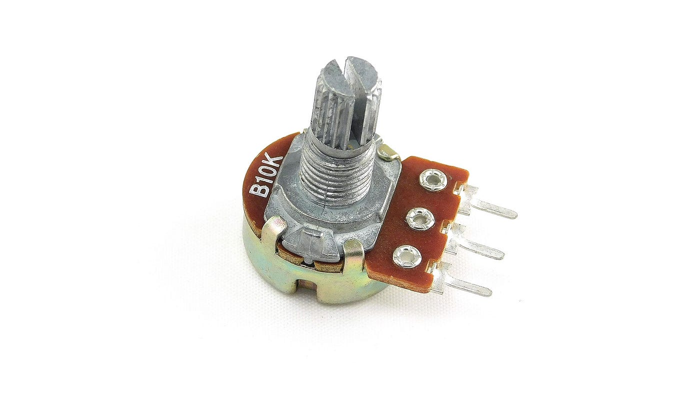
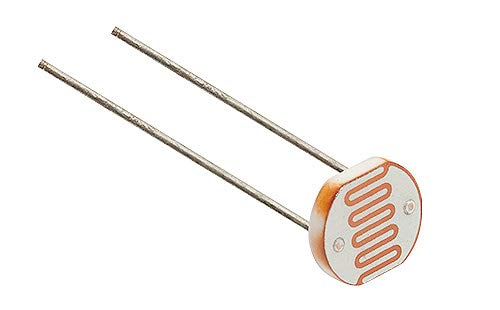

#### Introduction

Arduino is an open-source microcontroller platform widely used for learning embedded systems and Internet of Things (IoT) applications. It allows users to interface various input and output components through its digital and analog pins. These pins help Arduino sense user actions or environmental changes and process them into meaningful digital signals.

In this experiment, basic input components such as a **push button, potentiometer, slider switch, and photoresistor (LDR)** are interfaced with Arduino. The experiment helps learners understand how physical inputs are converted into electrical signals and how Arduino reads and processes these signals. This knowledge forms the foundation for building advanced applications like smart home systems, automation, robotics, and sensor-based monitoring systems.

#### Arduino as an Input Processing Unit

Arduino processes inputs using two main types of pins:

- **Digital Pins:** Used to read binary values such as HIGH (1) or LOW (0)
- **Analog Pins:** Used to read varying voltage levels between 0V and 5V

Arduino contains an **Analog-to-Digital Converter (ADC)** which converts analog voltage values into digital values ranging from **0 to 1023**. This enables Arduino to read data from sensors like potentiometers and LDRs accurately.

#### Components

#### 1. **Arduino Uno**

Arduino Uno is a microcontroller board based on the ATmega328P. It acts as the main processing unit in this experiment. Arduino reads input signals from various components and converts them into digital data for processing and control.

#### 2. **Push Button**

A push button is a simple digital input device that works on the principle of momentary switching. When the button is pressed, the circuit is completed and a digital signal is sent to the Arduino. When released, the circuit becomes open.

The push button is connected to a digital pin of Arduino and can use either an external pull-down resistor or Arduino’s internal pull-up resistor.

**Applications:**
- User input selection  
- Reset buttons  
- Start/Stop controls  

#### 3. **Potentiometer**

A potentiometer is a variable resistor that works as a voltage divider. Rotating its knob changes the resistance, which results in a varying output voltage between 0V and 5V.

The middle pin of the potentiometer is connected to an analog pin of Arduino. Arduino reads this changing voltage using the `analogRead()` function, producing values from 0 to 1023.

**Applications:**
- Brightness control  
- Volume control  
- Speed control  

#### 4. **Slider Switch**

A slider switch is a digital selector switch that provides stable ON and OFF states. It works as an SPDT (Single Pole Double Throw) switch, allowing selection between two different states.

The slider switch is connected to a digital pin of Arduino and outputs either HIGH or LOW depending on its position.

**Applications:**
- Mode selection  
- Power control  
- Configuration switching  

#### 5. **Photoresistor (LDR – Light Dependent Resistor)**

A photoresistor or LDR changes its resistance based on the intensity of light falling on it. When light intensity increases, the resistance decreases, and when light decreases, the resistance increases.

The LDR is used along with a fixed resistor to form a voltage divider circuit. The output voltage is connected to an analog pin of Arduino.

**Behavior:**
- Bright light → Higher analog value  
- Darkness → Lower analog value  

**Applications:**
- Automatic street lights  
- Light intensity measurement  
- Smart lighting systems  

#### Circuit Connections

1. **Push Button Connection**
   - One terminal of the push button is connected to a **digital input pin** of Arduino.
   - The other terminal is connected to **ground (GND)**.
   - A pull-up or pull-down resistor is used to avoid floating values.

2. **Potentiometer Connection**
   - One end connected to **5V**
   - Other end connected to **GND**
   - Middle pin connected to an **analog pin**

3. **Slider Switch Connection**
   - Common pin connected to a **digital pin**
   - Other terminals connected to **5V** and **GND**

4. **LDR Connection**
   - LDR connected in series with a fixed resistor
   - Output taken from the junction and connected to an **analog pin**

#### Conclusion

This experiment demonstrates the interfacing of basic input components with Arduino and explains how different types of inputs are read using digital and analog pins. Understanding these components is essential for developing real-world embedded systems and IoT applications.

